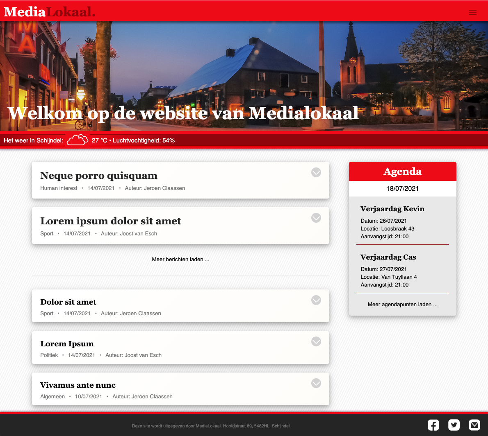

Installatiehandleiding: 
lokale nieuws-app: MediaLokaal.

1) Inleiding
2) Benodigdheden
3) Benodigdheden eigen weathermap key
4) Benodigdheden eigen firebase account

= 1 ==========================================================================================================================================================

De lokale nieuws-app MediaLokaal is een react-app gemaakt om inwoners van uw gemeente zelf
op de website het nieuws te laten schrijven en delen. Er wordt gebruik gemaakt van firebase om de
registratie en authenticatie te regelen. Firestore wordt gebruikt om de berichten op te slaan. 
Er wordt gebruik gemaakt van de OpenWeatherMap API om het huidige weer in Schijndel te laten zien.

= 2 ==========================================================================================================================================================

Benodigdheden:
- Clone mijn broncode: ($git clone {https://github.com/jeroen-1989/nieuws-app}) -> ($cd nieuws-app) -> ($npm install) -> ($npm start)
- Installeer Axios ($npm install axios --save);
- Installeer OpenWeatherMap ($npm install openweather-apis --save)
- Firebase ($ npm install --save firebase)
  - inloggegevens firebase console (firebase.google.com): 
    accountnaam: jclaa1989@gmail.com 
    password: Jclaa1989

= 3 ==========================================================================================================================================================

Benodigdheden eigen weathermap API-key:
- Een API-key van OpenWeatherMap (Current Weather Data)
    https://openweathermap.org/api
    - Registreer en log hier in en u krijgt een API-key met uitleg via de mail (het kan een paar uur duren voordat de key actief is).
    - Navigeer in mijn app naar src -> components -> weather -> Weather.js en vervang de api-URI op regel 13:
      - De link is de volledige URI, hierin staan "Locatie: Schijndel" en "Taal: Nederlands" om de API key heen. Let dus goed op:
        begin hiermee: https://api.openweathermap.org/data/2.5/weather?q=Schijndel,nl&units=metric&& 
        plak uw API key daarachter en zet het volgende daar weer achter tegenaan: &lang=nl

= 4 ==========================================================================================================================================================
        
- Firebase/firestore voor de registratie/authenticatie en de opslag van berichten/afbeeldingen:
    - Log jezelf in;
    - Ga naar de Firebase console;
    - Klik op "Create new project";
      - vul een projectnaam in;
      - selecteer "eur3 (europe-west)" als locatie;
    - Het startscherm van de Firebase console zal openen:
      - Klik op Add app
      - Bij select a platform kies je "Web"
      - Dan voeg je een App nickname toe en klik je op register app
      - Dan krijg je een script te zien. Kopieer vanaf "apiKey" t/m "measurementID" 
        - Ga naar het firebase.js bestand in mijn app en vervang "apiKey" t/m "measurementID" met de nieuwe gegevens
      - In de console van firebase staat "storage", voeg daar de map "images" toe.
    

